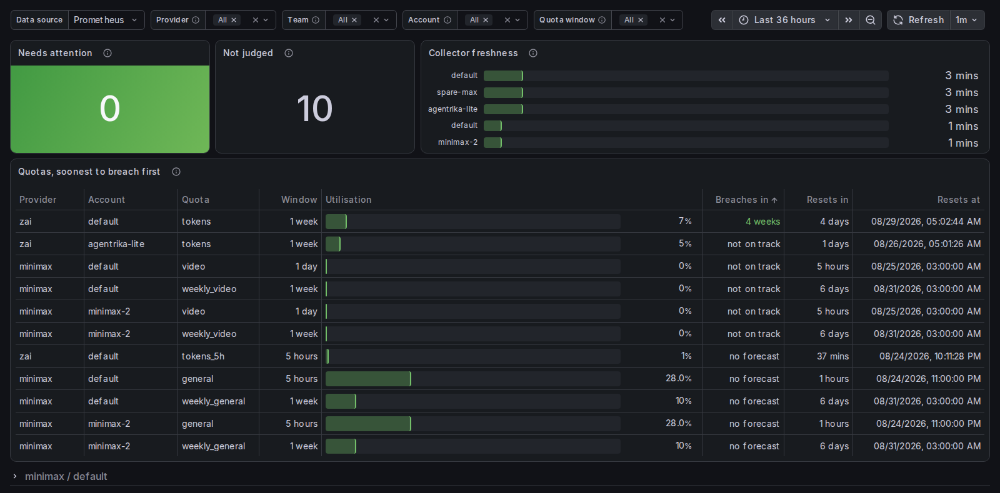
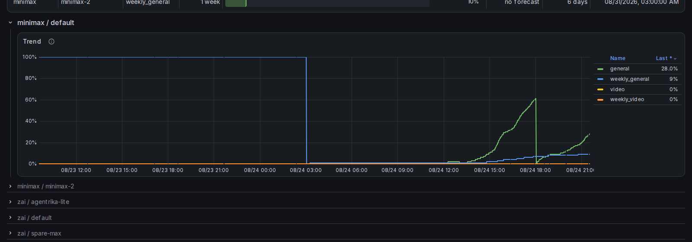

# loomwatch

**Prometheus exporter for prepaid LLM subscription quotas - per account, per
team, with alerts that name an owner.**

[](https://artifacthub.io/packages/helm/loomwatch/loomwatch)
[](LICENSE)

Fifteen providers sell prepaid plans with quota windows, and none of them will
tell your monitoring when a plan is nearly spent. loomwatch polls them, exports
what is left as Prometheus metrics, and ships the rules and the dashboard that
turn that into a page days before a job starts failing at three in the morning.



```console
helm install loomwatch oci://ghcr.io/concordloom/charts/loomwatch \
  --set auth.providers.MINIMAX_API_KEY=... \
  --set metrics.serviceMonitor.enabled=true \
  --set metrics.prometheusRule.enabled=true \
  --set dashboard.enabled=true
```

→ **[Artifact Hub](https://artifacthub.io/packages/helm/loomwatch/loomwatch)** ·
**[Chart documentation](charts/loomwatch/README.md)** (195 parameters, six
rules, runbooks, dashboard)

---

## What you get

**Metrics.** One series per account and quota window, so a plan with a
five-hour and a weekly cap is two series rather than an average of the two.

```
loomwatch_quota_utilization_percent{provider,quota_type,account_id}
loomwatch_quota_reset_timestamp_seconds{provider,quota_type,account_id}
loomwatch_quota_window_seconds{provider,quota_type,account_id}
loomwatch_agent_healthy{provider,account_id}
loomwatch_agent_last_cycle_age_seconds{provider,account_id}
```

Two properties are worth stating because alerts depend on them. **A series
exists when the provider declares the quota, not when it has been consumed** -
zero utilisation is a real reading, and an absent series means the plan has no
such quota. And **`quota_type` names a series, not a duration**: a provider may
reset `general` every five hours and `tokens` weekly. Read the length from
`loomwatch_quota_window_seconds`, never from the name.

**Six alerting rules**, each carrying a `runbook_url` that resolves to a real
section. Two thresholds, a burn-rate prediction, two collector-liveness rules,
and one that fires when a subscription has no owner.

**A dashboard**, shipped inside the chart, that answers the two questions an
operator actually has: is there anything to act on, and can these numbers be
believed. It works with a dashboard sidecar or with grafana-operator - the
chart renders the ConfigMap, and the [chart
README](charts/loomwatch/README.md#getting-the-dashboard-into-grafana) has the
recipe for either.

## Ownership, which is the point

An alert saying a quota is at 92% does not say whose it is.

`metrics.prometheusRule.teams` maps accounts to the teams that pay for them and
publishes `loomwatch:account_team`. Every default alert then carries a `team`
label, the dashboard filters by it, and Alertmanager can route a quota page to
the people who can act on it instead of to a shared channel nobody owns.

An account nobody mapped is published as `unassigned` and alerted on, rather
than quietly missing from every per-team view.

Ownership lives in chart values rather than in the collector because account
rows exist for three providers only; the rest report under `account_id`
`"default"` and have no row a column could hang on. Values reach every provider
that exports at all, survive a volume that does not persist, and are reviewed in
git rather than clicked into a panel. The same is true of the subscriptions
themselves: `auth.accounts` declares them, so a second key for a provider is a
line in a values file rather than a form somebody fills in after the fact.

## Reading the board



The vertical drops are window resets, and they are why the forecast column
sometimes says `no forecast` rather than a number. A trend measured across a
reset describes the boundary, not the consumption - and a forecast built on it
is an artefact. The board says so instead of printing a confident number.

`not on track` and `no forecast` are different statements: the first is a
finding, the second is the absence of one.

## Which providers reach `/metrics`

All fifteen:

> Anthropic, Synthetic, Z.ai, Copilot, Codex, MiniMax, Antigravity, Gemini,
> Cursor, Kimi Code, Grok, Moonshot, DeepSeek, OpenRouter, OpenCode Go.

Five of them - Synthetic, Cursor, Kimi, Grok and OpenCode Go - were collected
and shown on upstream's dashboard while exporting nothing at all, so no rule
could see them. That was upstream's shape rather than something this fork
removed, and it is fixed here rather than documented as a limitation
([#19](https://github.com/concordloom/loomwatch/issues/19)).

## How it is verified

This is the part that is hard to see from a README and easy to skip in a fork,
so it is worth being concrete about.

- **Every rule and every dashboard query is parsed by `promtool` on every pull
  request.** Before this fork, nothing had ever parsed either. A rule that
  cannot be evaluated does not fire and does not complain, which is the exact
  failure mode the rules themselves are written to avoid.
- **Rule semantics are unit-tested against a real PromQL engine**, not against
  rendered text - including the case where an account is missing from the
  ownership map and must appear as `unassigned` rather than disappear.
- **A browser drives the deployed dashboard** and asserts about rendering:
  that a reset time is a plausible date, that no row lost a value a neighbour
  kept, that a safe state is not painted as an alarm. Those defects are
  invisible to anything that inspects queries, because the queries were correct
  and the formatter was not.
- **The values schema refuses configurations that come up and then quietly fail
  to do their job** - a team name that would break the rule carrying it, an
  account id YAML would turn into `1e+06`, two entries claiming the same
  account.
- 3000+ Go tests, `-race` and `go vet` clean on every pull request.

## What is different from upstream

A fork of [onllm-dev/onWatch](https://github.com/onllm-dev/onWatch), which is a
genuinely good tool aimed at a developer's laptop: a menubar app, a local
dashboard, SQLite, self-update. Almost all of the code here is theirs, and the
provider integrations are entirely their work. Upstream's own feature list is
preserved verbatim in [README.upstream.md](README.upstream.md) - it describes
their laptop product, and not all of it is present here.

This fork points the same collector at a different target: a cluster, where the
interface that matters is `/metrics` and the consumer is Prometheus rather than
a human glancing at a menubar. On top of that it adds ownership, declarative
subscriptions, the alerting rules and the dashboard, the window length the
collector always knew and never published, and the verification above.

**The laptop product's surfaces are gone.** Self-update, the installers and the
marketing page came with the fork and could not work here: releases carry no
assets, the container is read-only and distroless, and the installers downloaded
upstream's binary. The unit of delivery is the image.

Two of upstream's interfaces remain in the tree deliberately - deleting upstream
files costs a conflict on every sync, and these cost nothing where they sit. The
**menubar HTTP surface is compiled into the image and answers only on
loopback**: the handlers call `isLoopbackRequest` and return 404 to anything
else, so a deployment exposes none of it, and the GNOME extension under
`gnome-extension/` remains a real consumer on a laptop. The macOS tray
application is behind `menubar && darwin` and never enters the image.

## Versioning

This fork has its own version line, recorded in `VERSION`, with the upstream
release it was cut from recorded separately in `UPSTREAM_VERSION`. Release tags
carry a `loom-v` prefix because a fork inherits the upstream tag namespace
wholesale - `v*` is both occupied and unsafe here.

A derived scheme such as `2.13.3-loom.1` was considered and rejected: under
SemVer a hyphen suffix denotes a pre-release, so it sorts *below* the release it
is built on, and anything comparing versions reads the fork as older.

## Contributing, and syncing with upstream

The fork is deliberately thin, and keeping it thin is the maintenance strategy.
See [docs/FORK.md](docs/FORK.md) for exactly which files diverge and how to
re-apply them when pulling upstream changes.

## License

GPL-3.0-only, inherited from upstream. This fork carries the same license and
the same copyright; modifications are marked in the files that carry them.
